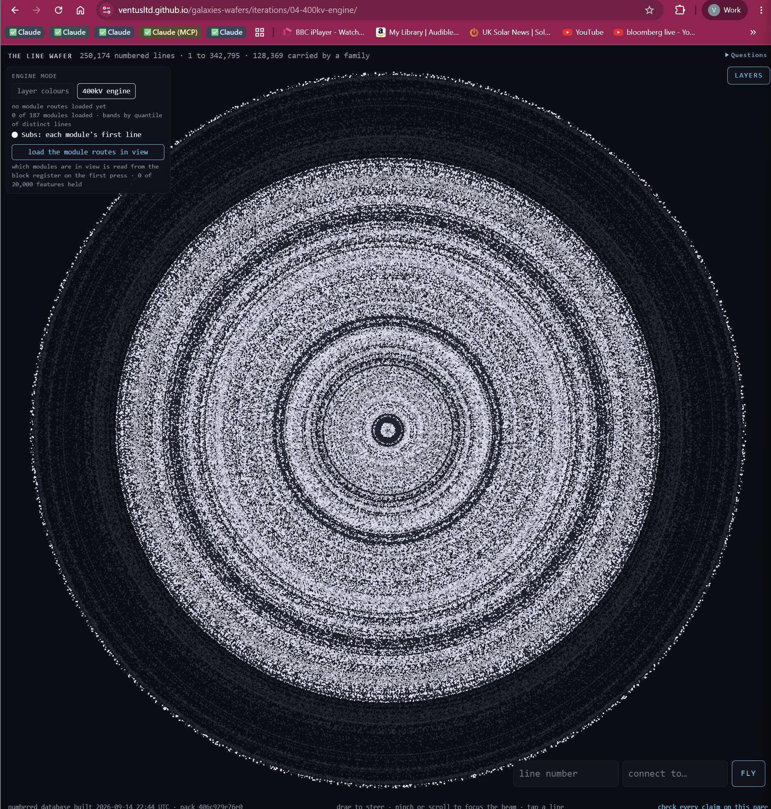
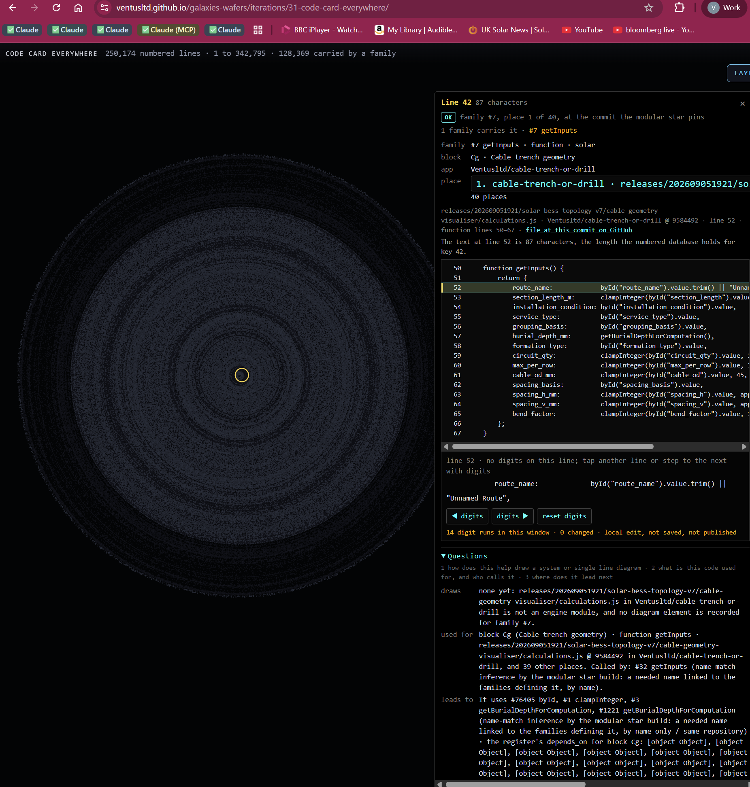
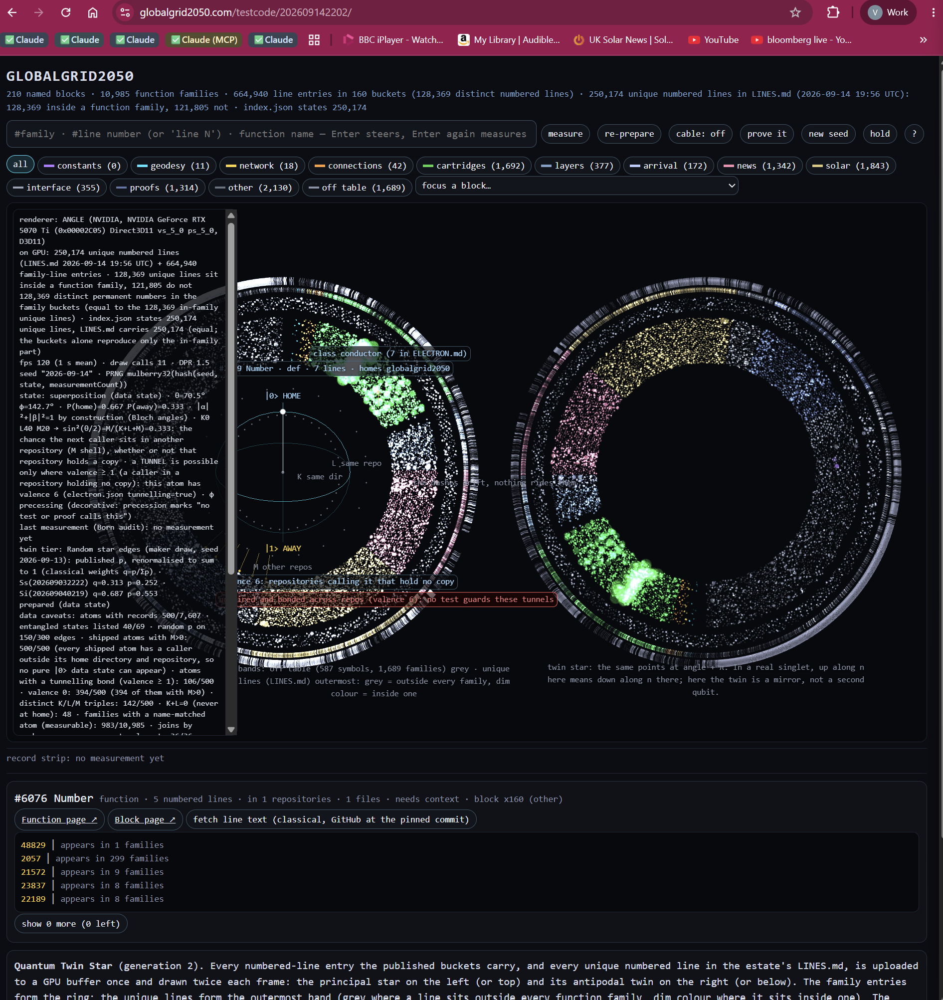
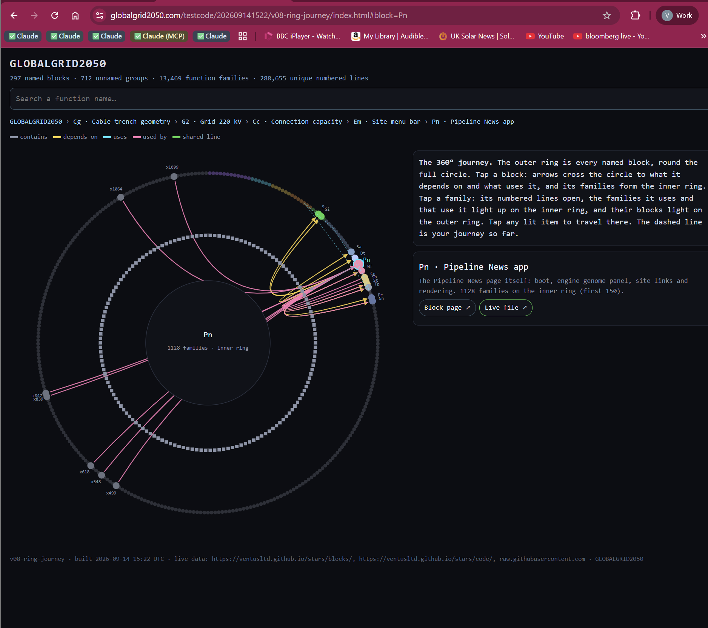
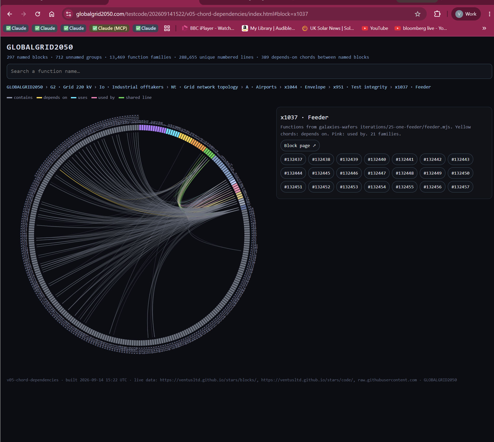
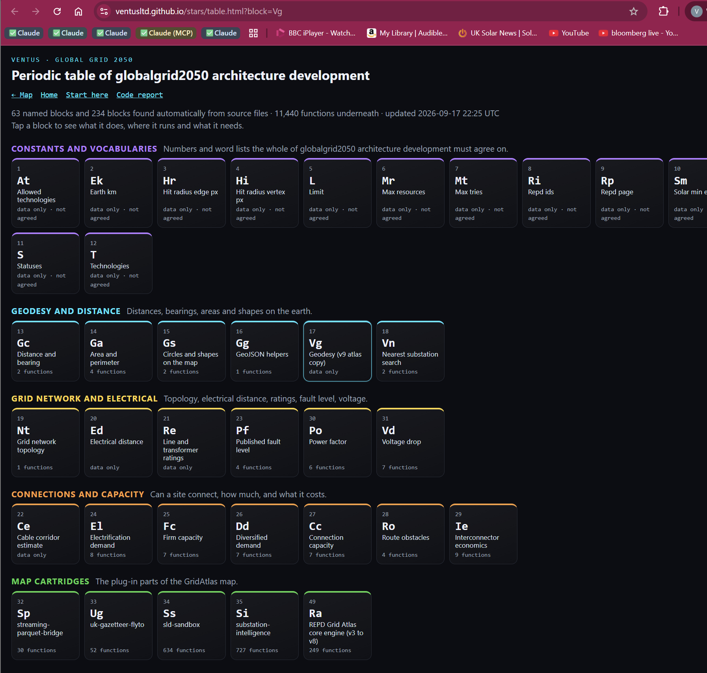

WARNING - Take a Deep Breath

VENTUS LTD via globalgrid2050.com is building something epic as seen here 

https://globalgrid2050.com/testcode/202609142202/
https://ventusltd.github.io/stars/table.html?block=Vg
https://globalgrid2050.com/testcode/202609141522/v02-radial-sunburst/index.html
https://globalgrid2050.com/testcode/202609141522/v07-flow-repos/index.html
https://ventusltd.github.io/galaxies-wafers/iterations/32-spider-and-galaxy/
https://ventusltd.github.io/galaxies-wafers/iterations/04-400kv-engine/
https://globalgrid2050.com/testcode/202609151413/?law=wafer
https://globalgrid2050.com/testcode/202609160224/
https://globalgrid2050.com/testcode/202609160207/
https://globalgrid2050.com/testcode/202609170129-quantum-twin-flights/
https://globalgrid2050.com/testcode/wafer-development-environment/202609170036-estate/
https://globalgrid2050.com/testcode/wafer-development-environment/202609170037-block-39885/?line=39885
https://globalgrid2050.com/testcode/wafer-development-environment/202609170045-land-gridatlas/?line=2&to=103145

This may not be exhaustive 
Our challenge is to prepare the tools that can allow 250k + lines of code to be show in our CPU WAFER GALAXY, A MATRIX MODEL, REAL VISUAL LEARNING OF COMPLEX SYSTEMS BY RE-ARRANGING PARTICLES TO DRAW ANY COMPLEX SYSTEM

## Sample images (18 September 2026)

Six views of the same 250,174 permanently numbered lines of code, drawn by different laws. Every dot is a real line at a real commit. The dots never change identity; only the law that places them changes.

### 1. The Line Wafer, engine mode

[galaxies-wafers iteration 04](https://ventusltd.github.io/galaxies-wafers/iterations/04-400kv-engine/). Every numbered line placed at r = √key, θ = key × golden angle. Module routes load only on request, in the manner of GridAtlas: nothing is drawn until asked. Type a line number, connect to another, fly.

### 2. A code card on any particle

[galaxies-wafers iteration 31](https://ventusltd.github.io/galaxies-wafers/iterations/31-code-card-everywhere/). Tap a dot and the card shows the exact source line at the pinned commit (here key 42: `cable-trench-or-drill`, `calculations.js` line 52, function `getInputs`), the family that carries it, what it draws, what it is used for and where it leads. Digits can be edited locally; nothing is saved or published.

### 3. The Quantum Twin Star

[testcode 202609142202](https://globalgrid2050.com/testcode/202609142202/). The same lines uploaded to the GPU once and drawn twice: the principal star and its antipodal twin. The family ring, the outer band of unique lines, and a seeded, logged measurement of a function's state (HOME or AWAY, from where its callers live). 120 frames a second on this card, 11 draw calls.

### 4. The 360° ring journey

[testcode 202609141522, v08](https://globalgrid2050.com/testcode/202609141522/v08-ring-journey/index.html#block=Pn). Every named block round the outer ring, its function families on the inner ring. Tap a block and the arrows cross the circle to what it depends on and what uses it. The dashed line is the journey so far.

### 5. Chord dependencies

[testcode 202609141522, v05](https://globalgrid2050.com/testcode/202609141522/v05-chord-dependencies/index.html#block=x1037). 389 depends-on chords between named blocks; here block x1037, Feeder, with its 21 families listed by permanent number.

### 6. The periodic table of blocks

[stars/table.html](https://ventusltd.github.io/stars/table.html?block=Vg). 63 named blocks and 234 found automatically from source, 11,440 functions underneath, grouped as constants, geodesy, grid network, connections and capacity, map cartridges. Tap a block to see what it does, where it runs and what it needs.

### What these are not
They chart code, data and published facts. They are not an engineering design tool and make no prediction about any cable or network; above 100 kW a chartered electrical engineer signs. The layouts are physics-inspired mathematics: code is not matter.

## The concept, in five sentences

1. **Every thing drawn is a particle with a permanent address**, and behind every particle there is something real: a line of code at a commit, a bus in a network, a cell in a module, a generated line that a recipe and a seed will produce again.
2. **Particles are all the same size. Meaning is carried by where they are and how densely they sit**, and position is computed from the address by a named law, never stored.
3. **A galaxy is unbounded by construction**: it is made of layers of 2¹⁸ = 262,144 slots, and a generated layer stores nothing but its recipe, its seed and a hash, so it costs bytes, not lines.
4. **Any complex system is a scope plus a law**: a typed command names the set of particles and the law that places them, whether spiral, ring, chord, metro-style network, floorplan or orbit; the particles do not change, the law does.
5. **Every number on a page comes from a script that can fail**, the checks state what they examined, and the tool charts the truth without claiming to be the engineer.

## Measured on 18 September 2026 (files in `measurements/`)

| claim | measurement | file |
|---|---|---|
| Same-sized particles can carry density without overlapping | 250,174 real lines, 9 layouts: the plain wafer has 0 overlapping pairs; a weighted law (weights from line length, bounded to [0.25, 1], angle by rank, smoothed) also 0; unbounded weights blew the rim from 585 to 4,527 units | `packing-result.txt`, `plain-wafer-250174.png`, `weighted-density-law-250174.png` |
| The angle law survives scale only inside layers | 64-bit CPU: exact to 4.6e-11 rad at key 250,174. 32-bit shader: 26 px off at a 1,000-px rim today, 1,361 px at key 2²⁴. Whole-number law: 0.19 px within a 2¹⁸ layer, 1,408 px across a spiral at 2³¹ | `exactness-result.txt`, `exactness.mjs`, `tools/particles.py exactness` |
| Millions of particles from the address, nothing uploaded | 4,194,304 points placed in the vertex shader from the integer key: 0 bytes of positions, 1.8 ms a frame on an RTX 5070 Ti (desktop Chrome, not a phone); pixels counted, not assumed | `shader-law-result.json`, `shader-law-4194304-points.png` |
| The particles can be nodes of a real calculation | coaxial cable field solved on wafer-law particles by meshless finite differences: worst error 0.0036 % at 209,154 particles against E(r) = V / (r ln(R/r₀)); the first attempt with staircased surfaces failed at 3.8 % and is kept | `coax-field-test.mjs`, `coax-field-result.json`, `coax-field-error-vs-node-count.png` |
| A generated layer regenerates identically | `tools/particles.py`: 262,144 lines from recipe + seed in 0.64 s; DNA test MATCH; the workflow repeats it on Ubuntu and Windows and fails if the hashes differ | `.github/workflows/particles.yml` |
| The public site, as a visitor | 182 URLs requested: homepage and manifest mostly 200; two unrendered template links on the homepage, three `null` manifest entries, front door shows 7 of 119 surfaces, 24 live surfaces unlisted | `site-links-20260918.json` |

## The plan

- **Layers.** New galaxies are stacks of 2¹⁸-slot wafers. `address = layer × 262,144 + slot`. Existing keys keep their numbers.
- **Exact angle.** Within a layer, `frac = (slot × 2,654,435,769) mod 2³² / 2³²`, `θ = 2π(1 − frac)`: whole-number arithmetic, identical bits on every device, the golden angle to 7.3e-10 rad per slot. A new named law; the frozen wafer stays frozen.
- **Generated layers.** Twin = (generator, commit, recipe, seed, slot). The DNA test regenerates on two machines and compares hashes, or refuses.
- **Physics that scales is closed-form**: motion as a pure function of (address, time, law), such as Kepler's equation solved per particle per frame. Interacting physics (collisions, fields) only inside a bounded, seeded, replayable scope, with conservation asserted by a test.
- **Networks as laws.** A graph (buses and branches, stations and lines) is drawn by placing the same particles along edges at fixed spacing under a schematic layout law; the topology is fact, the artwork is ours.
- **Matrices.** A dense grid (adjacency, a calculation table) is one instanced quad per cell or a data texture, never a DOM node per cell.
- **Loads on any device.** WebGL2 with a 2-D fallback that draws the same particles; first paint under 2 MB; WebGPU only as an optional fast path. Typed commands with a fixed grammar, parsed without a model, the same for a person and an AI.
- **Tests that can fail**, in order: T1 a physical phone; T2 exactness (in this repo); T3 cross-device positions within a pixel; T4 generator determinism (in this repo); T5 address to source in one request; T6 a law missing a fact refuses by name; T7 sixteen layers served from the workstation's second drive.

## How this repository links to the estate

| repository | what it gives the particles |
|---|---|
| [ventus-grid-engine](https://github.com/Ventusltd/ventus-grid-engine) | the instruction set: pure calculation modules, imported at a pinned commit; the [periodic table](https://ventusltd.github.io/stars/table.html) |
| [gridatlas](https://github.com/Ventusltd/gridatlas) | the loading discipline (nothing loads until asked, zoom gates, a queue of three) and the map cartridges |
| [cvaa](https://github.com/Ventusltd/cvaa) | the vaccines: checks that refuse (no `Math.random`, no private paths, twins must resolve) |
| [stars](https://github.com/Ventusltd/stars) | the numbered database: key → repo, commit, path, line |
| [globalgrid2050](https://github.com/Ventusltd/globalgrid2050) | the timestamped testcode surfaces and the homepage |
| [galaxies-wafers](https://github.com/Ventusltd/galaxies-wafers) | the iterations (code card, 400 kV engine mode, fast zoom) |
| [star-electron-star](https://github.com/Ventusltd/star-electron-star) | the cockpit: Line Wafer plus typed commands |

## Runners

`.github/workflows/particles.yml` runs on GitHub-hosted machines on every push to `tools/` and on demand: exactness, a generated layer on Ubuntu and on Windows, and the cross-machine DNA test. It needs no self-hosted runner and no model.

## Decisions open (the owner's)

1. Stack of layers for new galaxies, or one spiral.
2. The exact whole-number angle as a named law; which law is home.
3. Generated lines inside the estate or in their own galaxy.
4. Ventus-only, or other people's code, one galaxy each.
5. Whether brightness may carry a computed field or a running flash.

## The masterpiece of 18 September: `draw underground` on the wafer itself

https://globalgrid2050.com/testcode/wafer-development-environment/202609180205-underground/

The state wafer, unchanged in look, answering one typed command: 341 stations and 314 edges of the London Underground (Transport for London open data, topology only) drawn with 245,170 of the wafer's own numbered lines placed along the edges and at the stations, the core and the rim kept, by the same blend that gravity and the logo use. Verified live in headless Chrome: HUD `showing 245,170 of 250,174 lines · underground`, no page errors, pixels drawn. This is build B2 on the home renderer: a network as a law on the same dust. `release` returns every line to its own place.

## The deterministic translator: GridAtlas language → wafer language

`tools/networks.py` turns any GridAtlas layer into a draw on the one wafer. Input: GeoJSON as GridAtlas already serves it (Points and LineStrings with their properties). Output: the wafer's network language, `{"stations": [[x, y, name], …], "edges": [[i, j], …]}` in the unit square, north up. The rules, all fixed and printed with every run:

1. Equirectangular projection scaled by cos(mean latitude), so shapes keep their proportions; fit to [−0.9, 0.9] preserving aspect.
2. Lines simplified by Douglas–Peucker at a stated tolerance (0.002° for the grid); closed rings are split first so islands keep their shape.
3. Vertices shared by exact coordinate (rounded to 10⁻⁵°) become one node; edges join consecutive vertices; points become nodes without edges.
4. Every node is a vertex of the source or a point in the source. Nothing is invented; the source and its attribution travel inside the file.

One wafer, many draws: each file is a layer the wafer draws on command (`draw grid`, `draw substations`, `draw shotwick` …) with its own particles, and `release` returns them. Eight layers exist tonight: grid (400 kV + 132 kV + substations), grid400, grid132, substations, shotwick (the site with the lines around it), underground, uk, world. Version: https://globalgrid2050.com/testcode/wafer-development-environment/202609180245-real-systems/

## Physics on the wafer without reinventing it: the fault study

`tools/fault.py` runs a three-phase fault on pandapower's published 20 kV example network (mv_oberrhein) with pandapower's IEC 60909 short-circuit module, and the translator carries each line's initial symmetrical short-circuit current as an edge weight. On the wafer, `draw fault` places particles along each line in proportion to length × current, so the paths the fault current takes are the dense ones: illumination by density, no new colour, no new size. Measured on 18 September: fault at bus 147, I"k 1.874 kA at the fault, 34 of 181 lines carrying more than 5 % of the peak; bus fault levels from 1.874 to 5.79 kA across the network. The supply was stated (1,000 MVA, R/X 0.1) because the example carries none, and generation was excluded; both are written into the file.

Attribution: pandapower, BSD 3-clause, L. Thurner et al., IEEE Transactions on Power Systems 2018, pandapower.readthedocs.io. A published example network, not a real utility's data; a chart of a calculation, not a design; above 100 kW a chartered engineer signs.

Layers on the one wafer tonight: grid, grid400, grid132, substations, shotwick, underground, uk, world, trench, fault, and the wordmark. Buttons, typed commands and the text selector all reach the same laws. Version: https://globalgrid2050.com/testcode/wafer-development-environment/202609180245-real-systems/

## No warranty, as Ubuntu gives none

Everything here, the engine, the translator, every drawing and every study, is provided as is, without warranty of any kind, express or implied, exactly as the Apache License 2.0 (section 7) and Ubuntu's own terms state it. It is for rapid grid studies and for education, for anyone, at no charge. A drawing is a chart of published data or of a stated calculation; it is never a design, never a survey, never advice. Real work is signed by a chartered electrical engineer on a real project scope, and above 100 kW always.
